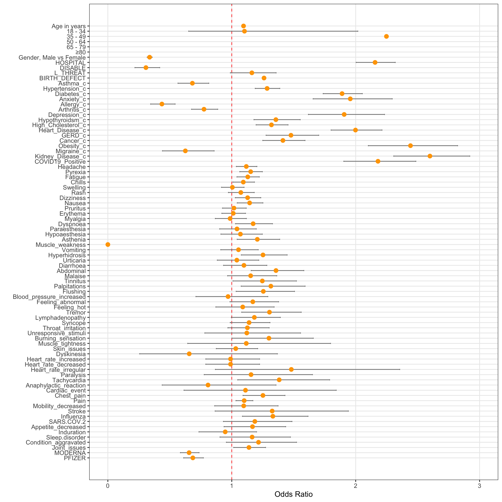

# Risk Factors for Mortality of Patients with Post-COVID-19 Vaccination Adverse Reactions 


****
## Project Overview


***
## Data Collection


The study included 375,804 patients who reported to experience post-COVID-19 vaccination side effects in the year 2020 and 2021 in the U.S. A raw dataset was collected from the Vaccination Adverse Reporting System(***VAERS***). The dataset contained the information about patients who had a vaccination and reported adverse reactions after that. This study only considered patients with post-COVID-19 vaccination adverse effects. 

Following patient's information from the dataset was included in the analysis : 

#### Demographic Characteristics

- Age
- Gender

#### Clinical Characteristics

- Current Illnesses
- History(chronic conditions)
- Allergic History
- Symptoms of Adverse Reactions

#### Clinical outcomes

- Hospital Admission Status
- Disability Status
- Birth defect status 
- Death Status

#### Other Information
- Vaccine Manufacturer


***
## Data Processing


The raw dataset was pre-processed in the following steps:

#### 1. Data Cleaning

- Removed non-COVID-19 patients records
- Removed patients records with missing age, gender, vaccination manufacturer values
- Fill the null values in 'DIED', 'DISABLE', 'L_THREAT', 'HOSPITAL','BIRTH_DEFECT' fields with 'No'

#### 2. Feature Extraction

Symptom Features

- Matched symptom strings with symptoms text provided in patient's symptom records to extract symptom features


Comorbidity Features

- Created 'COMORBIDITY' column by combining text from 'CUR_ILL' and 'HISTORY'

- Applied CounterVectorizer to 'COMORBIDITY' column to get the 15 most prevalent comorbidities 

- Matched comorbidity strings with the text provided in 'CUR_ILL' and 'HISTORY' which represents patient's current illnesses and chronic conditions respectively to extract comorbidity features


***
## Statistical Analysis 


A descriptive analysis was performed to assess the distribution of patient demographic characteristics, clinical characteristics, and survival status (Alive vs Died). Age was expressed as mean (SD). All other variables except Age were categorical and expressed as counts and percentages. χ2 test was used to test for statistical differences between different groups for categorical variables. The mean age difference between the two survival groups was examined using t-test. A 2-sided P<.05 was considered statistically significant.

Multiple logistic regression was performed to assess the association between individual potential risk factors and the post-COVID-19 vaccination mortality, adjusting for age and sex. The strength of any association was evaluated by calculating odds ratio (OR) and 95% confidence interval(CI). All patient characteristics including age, sex, and comorbidities and symptoms that considered in this study were then included in a single multivariable logistic regression model. Odds ratios from the age-and-sex adjusted and fully adjusted models are reported with 95% confidence intervals. 

All analyses were conducted using R, version 4.1.0. 


***
## Results

### Patient Characteristics 

A total of 375,804 patients who reported post-COVID-19 side effects, including 371,185 (98.8%) patients were alive at the time of data collection and 4,619 (1.2%) deceased patients were analysed. The mean age (SD) was 48.6 (18.0) years for patients who were survived and 73.5 (15.8) years for those who died. Patients aged 65 years and older accounted for 22.32% of the total sample (83,891 patients) and 75.9% of all deaths (3510 of 4619). While more women suffered from adverse reactions after COVID-19 vaccination (272,142 patients [72.4%]), there were more deaths in men (2,597 [56.2%]) [Table 1](https://github.com/JiyoungLee90/COVID-19-Adverse-Reaction/blob/main/table1.pdf).

### Baseline Comorbidities

In the overall patient sample, the most common comorbidities included hypertension (32,218 [8.57%]), asthma (24,365 [6.48%]), diabetes (19,589 [5.21%]), and allergy (18,472 [4.92%]). The most frequent comorbidity was hypertension for both patient groups(31,345 [8.44%] for the survival group and 873 (18.9%) for the death group). In the survival group, this was followed by asthma (24,241 [6.53%]), diabetes (18,868 [5.08%]), and allergy (18,394 [4.96%]). On the other hand, the next most frequent comorbidities were diabetes (731 [15.8%]), high cholesterol (502 [10.9%]), and heart diseases (486 [10.5%]) among the patients who died [Table 1](https://github.com/JiyoungLee90/COVID-19-Adverse-Reaction/blob/main/table1.pdf).


### Adverse Reaction Symptoms 

Among 58 symptoms assessed in this analysis, the most common symptom was pain (133,316 [35.5%]), followed by headache (73,462 [19.5%]), chills (60,962 [16.2%]), and pyrexia (60,220 [16.0%]) regardless of survival status. Patients who died had a slightly higher prevalence of most of those symptoms than those who survived [Table 1](https://github.com/JiyoungLee90/COVID-19-Adverse-Reaction/blob/main/table1.pdf).


### Vaccination Manufacturer

Among all three COVID-19 vaccines assessed in the overall sample, Moderna COVID-19 vaccine was most commonly used (177,400 [47.2%]), followed by Pfizer COVID-19 vaccine (164,435 [43.8%]) and Janssen COVID-19 vaccine (33,969 [9.04%])[Table 1](https://github.com/JiyoungLee90/COVID-19-Adverse-Reaction/blob/main/table1.pdf).


### Clinical Outcomes

The mortality rate in patients with post-COVID-19 vaccination was 1.2% (4,619 of 375,804). One-fourth of patients (1157 [25.0%]) who died were admitted to a hospital. 177 (3.83%) patients who died and 6,111 (1.65%) patients who survived experienced a life-threatening experience associated with their COVID-19 vaccination. 5,055(1.36%) and 38 (0.82%) of vaccine recipients were disabled as a result of the COVID-19 vaccination in the survival group and the death group respectively. Among 190 (0.05%) of patients who had a congenital anomaly or birth defect associated with the COVID-19 vaccination, 188 (0.05%) patients were alive and 2 (0.04%) patients died [Table 1](https://github.com/JiyoungLee90/COVID-19-Adverse-Reaction/blob/main/table1.pdf).


### Risk Factors Associated with Post-COVID-19 Vaccination Mortality

Univariate logistic regression results showed that older age was the risk factor strongly associated with death. The odds of death were 115.92 times higher in patients aged 80 years or older than among those aged 0 to 17 years (odds ratio [OR], 115.92; 95%CI, 71.39-206.21; P<.001). Multivariable logistic regression shows that male patients had nearly 3 times greater odds of death than female patients (OR, 0.34; 95%CI, 0.32-0.36; P<.001) when adjusted only for age, decreasing to 2.6 times after adjustment for all included factors (OR, 0.38; 95%CI, 0.36-0.41; P<.001)[Table 2](https://github.com/JiyoungLee90/COVID-19-Adverse-Reaction/blob/main/table2.pdf).

When adjusted only for age and sex, all 16 comorbidities considered in this analysis were associated with increased or decreased odds of death. However, having the following conditions: hypertension, hypothyroidism, high cholesterol, GERD was found to be no longer significantly associated with increased odds of death after fully adjusted. People with existing medical conditions include diabetes, anxiety, depression, heart diseases, cancer, obesity, kidney diseases, COVID-19 positive history were at higher risk of post-COVID-19 vaccination death than those without. On the other hand, decreasing risks were seen with having conditions such as asthma, allergy, arthritis, migraine [Table 2](https://github.com/JiyoungLee90/COVID-19-Adverse-Reaction/blob/main/table2.pdf).

Two symptoms that patients developed after the COVID-19 vaccination, abdominal issues (OR, 1.23; 95%CI, 1.04-1.45; P =.014) and tremor (OR, 1.22; 95%CI, 1 -1.47; P=.0041) were associated with patient mortality. Some symptoms including headache, pyrexia, fatigue, chills, dizziness, nausea, dyspnoea, asthenia, hyperhidrosis, tinnitus, palpitations, flushing, lymphadenopathy, burning sensation, chest pain, pain, influenza-like symptoms, and joint issues were found to be associated with increased odds of death compared with patients without having those symptoms when adjusted only for age and gender [Table 2](https://github.com/JiyoungLee90/COVID-19-Adverse-Reaction/blob/main/table2.pdf).

The manufacturer of the COVID-19 vaccine was also found to be associative. Patients who had an either Moderna (OR, 0.66; 95%CI, 0.58-0.74; P<.001) or Pfizer (OR, 0.67; 95%CI, 0.6-0.76; P<.001) vaccine had decreased approximately 30% of odds of death compared with those who had a Janssen vaccine [Table 2](https://github.com/JiyoungLee90/COVID-19-Adverse-Reaction/blob/main/table2.pdf).

Hospital admission status was associated with a higher risk of death
(OR, 2.19; 95%CI, 2.02-2.37; P<.001). However, patients who became disabled (OR, 0.21; 95%CI, 0.36-0.41; P<.001) or experienced a life-threatening event (OR, 0.71; 95%CI, 0.6-0.84; P<.001) as a result of the COVID-19 vaccination had reduced odds of death [Table 2](https://github.com/JiyoungLee90/COVID-19-Adverse-Reaction/blob/main/table2.pdf).


**Fig. 1 Multiple Logistic Regreesion Analysis of Risk Factors for Mortality in Patients with Post-COVID-19 Adverse Reactions: Odds Ratios after Adjusted for Age and Sex**




***


```python

```
